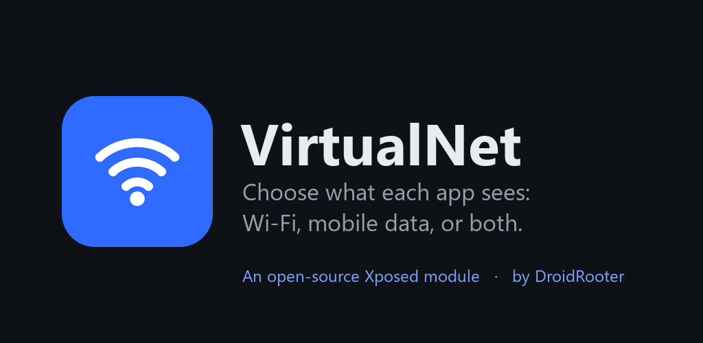
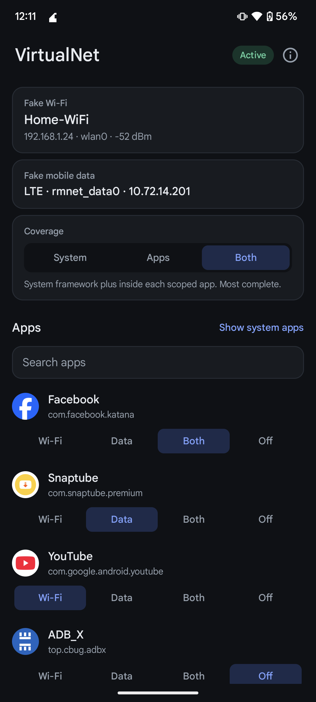
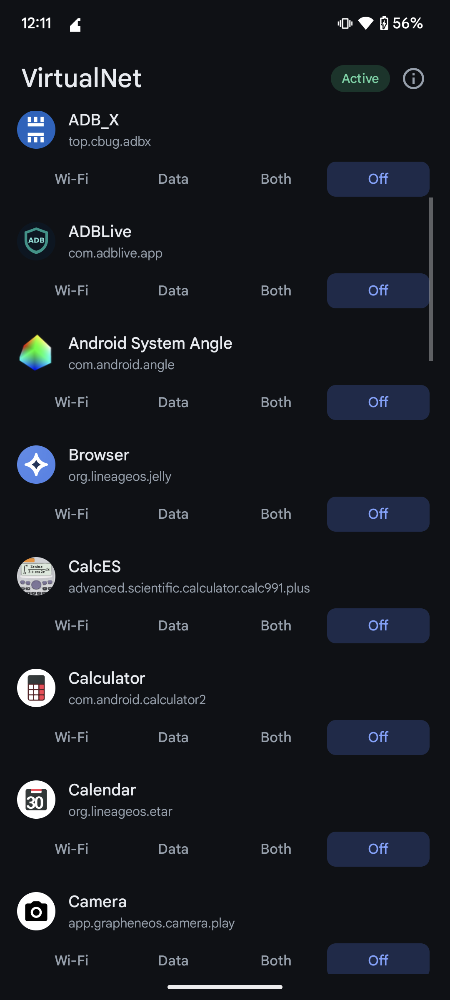
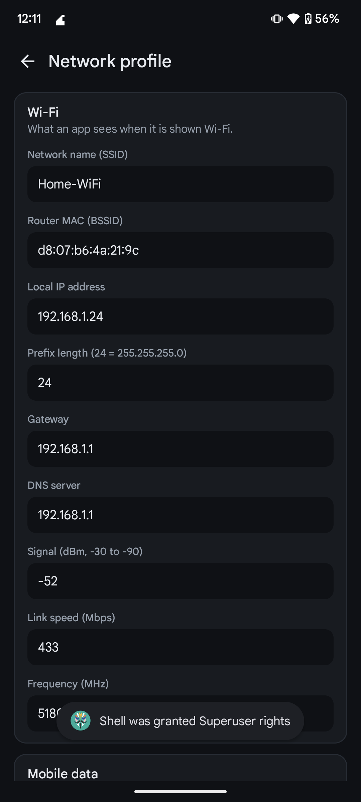
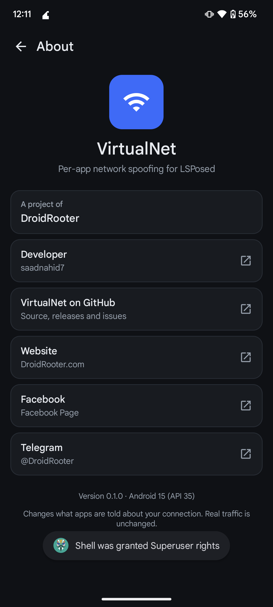

<div align="center">



# VirtualNet

**Choose what each app sees: Wi-Fi, mobile data, or both.**

An open-source Xposed module for Android 9 and up, by [DroidRooter](https://droidrooter.com).

[](LICENSE)
[](https://github.com/saadnahid7/VirtualNet/releases/latest)
[](https://github.com/saadnahid7/VirtualNet/releases)
[](#compatibility)
[](https://github.com/libxposed/api)
[](https://github.com/saadnahid7/VirtualNet/stargazers)

[](https://droidrooter.com)
[](https://t.me/DroidRooter)
[](https://www.facebook.com/droidrooter)

   

</div>

---

## Why VirtualNet

Some apps only work, or only download, when they think you are on Wi-Fi. Others insist on mobile data. VirtualNet lets you decide, **per app**, what the app is told about your connection, without changing the connection itself.

- A phone on mobile data can look like it is on Wi-Fi to one app.
- A phone on Wi-Fi can look like it is on mobile data to another.
- Everything else on the phone sees the truth.

Your real traffic never changes. Only the answers an app gets when it asks "what am I connected to?" change.

## Table of contents

- [Features](#features)
- [Modes](#modes)
- [Coverage: system framework or inside the app](#coverage-system-framework-or-inside-the-app)
- [Requirements](#requirements)
- [Installation](#installation)
- [Usage](#usage)
- [What it covers](#what-it-covers)
- [Compatibility](#compatibility)
- [Limits](#limits)
- [FAQ](#faq)
- [Lab app](#lab-app)
- [Building](#building)
- [Project layout](#project-layout)
- [Open source](#open-source)
- [Contributing](#contributing)
- [Disclaimer](#disclaimer)
- [Acknowledgements](#acknowledgements)
- [From DroidRooter](#from-droidrooter)
- [License](#license)

## Features

- **Per-app control.** Pick Wi-Fi, Data, Both or Off for each app in one list. Changes apply live, with no reboot.
- **One coherent identity.** SSID, router MAC, local IP and range, gateway, DNS, signal, link speed, frequency, mobile type and interface all come from one editable profile, so an app that cross-checks sees a consistent network.
- **System-level coverage.** Hooks inside `system_server` and the phone process cover every app you pick, callbacks included, without scoping each app.
- **Inside-the-app coverage.** Optional hooks in a scoped app also cover socket addresses, network interfaces and Wi-Fi scan results.
- **Choose your layer.** A switch selects System, Apps or Both.
- **Small and quiet.** About 120 KB, no network permission, no ads, no analytics, no accounts.
- **Verifiable.** A detector app (built from source) shows exactly what an app would see, so you can check a change in seconds.

## Modes

| Mode | The app is told |
|---|---|
| **Wi-Fi** | Wi-Fi connected and not metered. Mobile data disconnected. |
| **Data** | Mobile data connected and metered. Wi-Fi off and disconnected. |
| **Both** | Wi-Fi is the default network and mobile data is also connected. |
| **Off** | Nothing is changed. |

## Coverage: system framework or inside the app

VirtualNet has two layers. A switch on the main screen chooses which one works.

| Setting | What runs | Scope you add in Vector or LSPosed |
|---|---|---|
| **System** | Hooks in the system framework only | System Framework and Phone Services |
| **Apps** | Hooks inside each app only | Each app you pick |
| **Both** *(default)* | Both layers | System Framework and Phone Services, plus apps for socket and interface checks |

Use **Apps** if you would rather not touch the system framework, or on a ROM where the system layer does not attach. Android 9 defaults to Apps.

## Requirements

- A rooted device with an LSPosed-compatible framework that supports the modern **libxposed API 102**, such as [Vector](https://github.com/JingMatrix/Vector) or a recent [LSPosed](https://github.com/LSPosed/LSPosed).
- Android 9 or newer (API 28 and up). See [Compatibility](#compatibility) for what has been verified.

> [!IMPORTANT]
> VirtualNet is built on the modern libxposed API. Legacy Xposed and EdXposed are not supported.

## Installation

1. Download the latest APK from [Releases](https://github.com/saadnahid7/VirtualNet/releases/latest) and install it.
2. Open Vector or LSPosed, enable **VirtualNet**, and add **System Framework** and **Phone Services** to its scope. VirtualNet offers this on first launch.
3. Restart the device, or its framework, once so the system hooks load.
4. Open VirtualNet and pick a mode for an app. No restart is needed after that.

Prefer to work only inside apps? Set Coverage to **Apps**, then scope each app instead.

## Usage

1. Open VirtualNet and look at the status pill. **Active** means the framework is connected.
2. Tap a mode on any app row: **Wi-Fi**, **Data**, **Both** or **Off**.
3. Open the app you changed. If it was already running, close it once so it asks again.
4. To change what the fake network looks like, tap a profile card and edit it.

The recommendation banner has a **Hide** button if you do not want it.

## What it covers

| Area | System layer | Inside a scoped app |
|---|:---:|:---:|
| Network capabilities, transport, metered flag, link properties, callbacks | yes | yes |
| Legacy network info and the network list | yes | yes |
| Wi-Fi state, connection info, DHCP | yes | yes |
| Mobile network type and data state | yes | yes |
| A stand-in cellular network in Both mode | yes | yes |
| Socket local address, network interfaces | no | yes |
| Wi-Fi scan results, `Settings.Global` | no | yes |

## Compatibility

| Android | API | Status |
|---|---|---|
| 17 | 37 | Verified |
| 16 | 36 | Verified |
| 15 | 35 | Verified on a real device |
| 14 | 34 | Verified |
| 13 | 33 | Verified |
| 12 | 31 | Verified |
| 11 | 30 | Verified |
| 10 | 29 | Verified |
| 9 | 28 | **Unverified.** Supported by the app, but not yet confirmed on a working framework. |

"Verified" means the Wi-Fi, Data, Both and Off modes were checked with the Lab app on a rooted Vector setup, for both the system layer and the inside-the-app layer. Details are in [docs/TESTING.md](docs/TESTING.md).

## Limits

- Anything outside the Java framework sees the real network: raw sockets, native code and server-side checks such as your public IP, latency or carrier attestation.
- Both mode adds a stand-in cellular network. A callback registered for a cellular request does not fire for it.
- Status bar and quick settings are unchanged.
- After installing or updating the module, restart the framework once so the system hooks reload.
- Android 9 is unverified, see above.

## FAQ

**Does it change my real connection?**
No. It only changes what selected apps are told.

**Will it make a Wi-Fi-only download work over mobile data?**
The app will believe it is on Wi-Fi and proceed. The data still uses your mobile connection.

**Do I have to add every app to scope?**
Not with System or Both coverage. Add an app to scope only if you want socket and interface checks covered too.

**Why is nothing happening?**
Check that the status pill says **Active**, the module is enabled, System Framework and Phone Services are in scope, and the framework was restarted after installing.

**Can it hide that I use a VPN?**
It leaves VPN transports alone.

## Lab app

`lab/` holds a small detector called **VirtualNet Lab**. It is a development tool and is not shipped in releases. Build it from source (`./gradlew :lab:assembleDebug`) if you want to check what an app would see. It reads the connection through every route an app can use, prints a verdict (Wi-Fi, mobile or both) and logs one line per probe under the tag `VNL`. Set a mode for it like any other app to see the effect.

## Building

You need JDK 17 or newer and the Android SDK with platform 37.

```bash
./gradlew :app:assembleRelease :lab:assembleRelease
```

The release build is unsigned unless `.local/signing.properties` exists. The test scripts in [`scripts/`](scripts) drive rooted emulators and devices.

## Project layout

```
app/       the module and its settings app
  config/    modes, coverage, profile, settings storage
  hooks/     module entry point
    common/    shared reflection and object shaping
    app/       hooks inside a scoped app
    system/    hooks in system_server and the phone process
  ui/        screens
lab/       the detector app
docs/      testing notes, screenshots
scripts/   emulator and device test harness
fastlane/  store listing text and images
```

## Open source

VirtualNet is free and open source under the [MIT license](LICENSE). The module, the settings app, the Lab detector, the test scripts and the store listing are all in this repository, and releases are built from it. There is no closed part, no tracking and no account. Read it, audit it, fork it.

## Contributing

Issues and pull requests are welcome. Please read [CONTRIBUTING.md](CONTRIBUTING.md) first. If a hook fails on your device, open an issue with your Android version, ROM, framework and the output of the Lab app.

## Disclaimer

VirtualNet is meant for privacy, testing and getting your own apps to behave the way you want. You are responsible for how you use it. Do not use it to break an app's terms, get around paid services or defraud anyone. The software is provided as is, without warranty.

## Acknowledgements

- [libxposed](https://github.com/libxposed) for the modern Xposed API and service library.
- [LSPosed](https://github.com/LSPosed/LSPosed) and [Vector](https://github.com/JingMatrix/Vector) for the frameworks it runs on.

## From DroidRooter

VirtualNet is a project of **DroidRooter**, a small team building tools for rooted Android.

- **Website:** [droidrooter.com](https://droidrooter.com)
- **Telegram:** [@DroidRooter](https://t.me/DroidRooter)
- **Facebook:** [facebook.com/droidrooter](https://www.facebook.com/droidrooter)
- **DRVCAM, DroidRooter's Virtual Camera:** [droidrooter.com/drvcam](https://www.droidrooter.com/drvcam/) feeds your own video or images to apps in place of the camera, on rooted Android 9 to 17.

If VirtualNet helps you, star the repo and follow DroidRooter for more.

## License

[MIT](LICENSE) © DroidRooter
